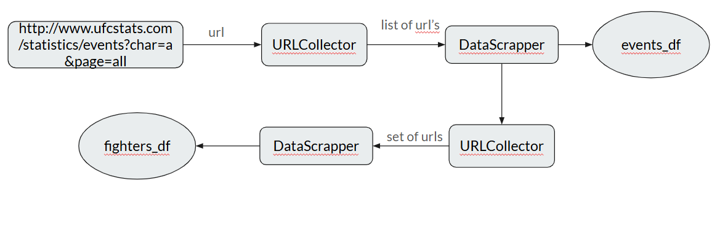
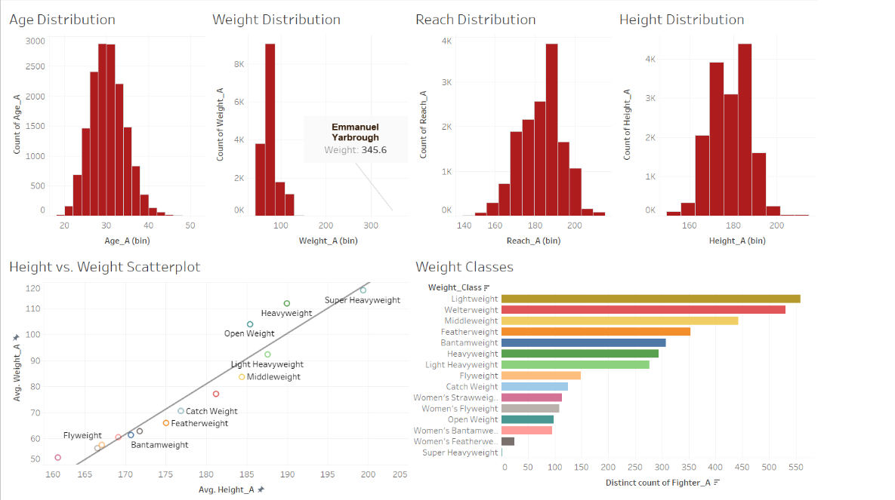
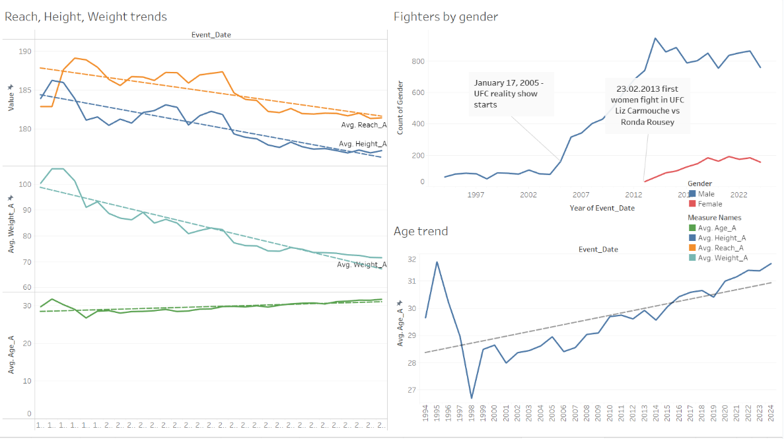
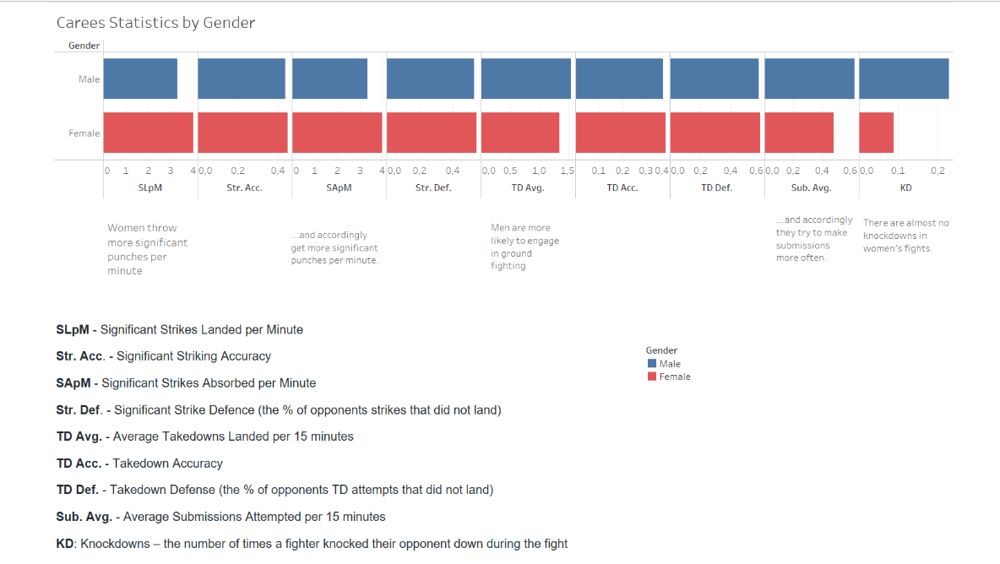

# UFC fights data analysis
## Webscrapping
The data on the site ufstats.com is presented in the following form with two pages: http://www.ufcstats.com/statistics/events/completed?page=all and http://www.ufcstats.com/statistics/fighters?char=a&page=all

It seems logical to separate the collection of data on fighters and events

However during the data processing it turned out that the page with the fighters (despite the tag all) did not list all of them. So the data collection procedure had to be changed. While receiving information about the events, I began to extract links to the fighters who participated in them and add it to the set of existing links.

## Data Preparation
The result was dataframes of the following form

We can use a left join to attach information about each fighter from the event.

The data on the site is presented in such a way that in the absolute majority of cases the fighter listed first among the participants (as a result of web scraping he becomes Fighter_A) won the fight. It seems logical to "mirror" the data to balance the target function.

## Insights
All vizualizations were made in Tableau
The distribution of age, arm length and height of the fighters follows the same laws as for ordinary people. The weight is heavily skewed to the left due to several fighters with high weight and one with very high weight.

Analysis of factors of success in a fight. The visualizations below show that the greater the advantage in arm length, height and the younger the fighter, the greater his chances of winning (pretty obvious). But there is no obvious connection with weight.

Interesting historical trends in the UFC. The average fighter is getting smaller in height, arm length, and weight.

Women fighters throw more significant punches per minute and accordingly get more of them. However there is almost no knockdowns in womens' fights.
Men are more likely to engage in ground fighting and they try to make submissions more often.

## ML (in process)
### Feature engineering
Some additional features were engineered (the list might be outdated):
- Total fights
- Total wins
- Total losses
- Current win streak
- Current loss streak
- Longest win streak
- Longest loss streak
- Total fights difference
- Win percentage
- Win/Loss streak ratio
- Age groups
- Stance match
- Current streak difference
- Streak_continuation_prob
- Reach/Age interaction
- Reach/Win sreak interaction
- Weight/Reach interaction
- ...
### Training model
Random Forest was used in order to predict outcome of a fight based on historical data on each fighter  
Cross-validated results on the training set:
- Сross-validated Accuracy: 0.7857375175482415
- Cross-validated Recall: 0.7784767673102151
- Cross-validated Precision: 0.7869430438044469
- Cross-validated F1: 0.7826071992986398

Results on test set:
- Test Accuracy: 0.7936427850655903
- Test Recall: 0.7913598429062346
- Test Precision: 0.8039900249376558
- Test F1 Score: 0.797624938149431

Feature importance:

# ! There is probably a data leak during feature engineering, this part is still under development